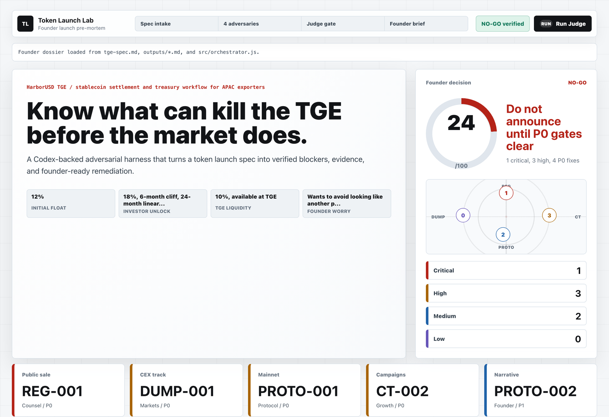

<div align="center">

# 🧪 Token Launch Lab

### *An AI red team that tries to kill your token launch — before mainnet does.*

Token launches are irreversible. One bad vesting schedule, one missed exploit vector,
one weak narrative, or one regulatory blind spot can torch a launch **in public**.
Token Launch Lab runs adversarial AI agents that attack your launch from every angle,
then a Judge Agent verifies every finding before it ships.

<br/>

[](SUBMISSION.md)
[](codex-goal.md)
[](package.json)
[](#-safety-boundaries)

<br/>



<br/>

```
   ┌─────────────┐   ┌──────────────┐   ┌────────────────┐   ┌──────────────┐
   │  DUMP RISK  │   │ PROTOCOL RISK│   │ REGULATORY RISK│   │  CT ADVERSARY│
   └──────┬──────┘   └──────┬───────┘   └───────┬────────┘   └──────┬───────┘
          └─────────────────┴─────────┬─────────┴───────────────────┘
                                       ▼
                            ┌──────────────────────┐
                            │   ⚖️  JUDGE AGENT      │
                            │  verify · score · kill│
                            └──────────┬───────────┘
                                       ▼
                              📄  KILL REPORT
```

</div>

---

## 💡 The Thesis

> The future crypto founder does not need more AI that **agrees** with her.
> She needs an AI that tries to **kill the launch first** — so reality doesn't get the chance.

Most AI tools help you *build* launch materials. Token Launch Lab does the opposite: it's a
**Codex-backed adversarial agent harness**, not another friendly chatbot. Codex runs specialized
agents that each try to break your launch from a different direction, write inspectable markdown
reports, and submit them to a local Judge Agent that rejects anything without traceable evidence.

---

## ⚔️ Meet the Red Team

| Agent | Attacks | Writes |
|-------|---------|--------|
| 📉 **Dump Risk** | Investor/team unlocks, TGE float, liquidity & MM allocation, dump pressure | `outputs/dump-risk.md` |
| 🛡️ **Protocol Risk** | Audit status, pause policy, multisig, incident response readiness | `outputs/protocol-risk.md` |
| ⚖️ **Regulatory Risk** | Public-sale flags, jurisdiction ambiguity, incentive-campaign risk | `outputs/regulatory-risk.md` |
| 🐦 **CT Adversary** | Narrative fragility, likely crypto-Twitter criticism, token-necessity & farming optics | `outputs/ct-adversary.md` |
| 🧑‍⚖️ **Judge / Orchestrator** | Verifies schema, evidence, severity, safety boundaries; computes readiness | `outputs/kill-report.md` |

Every finding must cite an **exact quote** from `tge-spec.md`. No evidence → the Judge rejects it.

---

## 🚀 60-Second Quickstart

```bash
npm install
node src/orchestrator.js   # run the Judge Agent over the agent reports
npm run ui                 # launch the live demo UI
```

The orchestrator reads the Codex-authored reports in `outputs/`, verifies them, prints
pass/revision status, computes launch readiness, and writes:

- 📄 `outputs/kill-report.md` — ranked failure modes + readiness score
- 🔧 `outputs/remediation.md` — prioritized defensive fixes
- 🧑‍⚖️ `outputs/judge-evaluation.md` — the verification verdict

Then open the dashboard:

```text
http://127.0.0.1:3000
```

---

## 🏗️ Architecture

```
Codex /goal
  ├─ reads   codex-goal.md · AGENTS.md · tge-spec.md
  ├─ writes  outputs/dump-risk.md
  ├─ writes  outputs/protocol-risk.md
  ├─ writes  outputs/regulatory-risk.md
  ├─ writes  outputs/ct-adversary.md
  └─ Judge Agent → node src/orchestrator.js
                     └─ writes kill-report.md · remediation.md · judge-evaluation.md
```

**Why this is a real harness, not a prompt:**

- 🎯 **Codex integration** — `codex-goal.md` is the exact `/goal` prompt.
- 🤝 **Multi-agent orchestration** — `AGENTS.md` defines five role contracts.
- 🧠 **Inspectable markdown memory** — agents write to `outputs/`, nothing hidden.
- ✅ **Verification** — `src/orchestrator.js` checks fields, evidence, severity, confidence, safety.
- 🏁 **Termination** — the run completes only when **all** reports pass.
- ♻️ **Recovery loop** — failed reports are revised individually and re-checked.

---

## 📊 Scoring

| Dimension | Values |
|-----------|--------|
| **Severity** | `low` · `medium` · `high` · `critical` |
| **Confidence** | `low` · `medium` · `high` |
| **Evidence** | every finding cites `tge-spec.md` |
| **Remediation priority** | `P0` · `P1` · `P2` |
| **Launch readiness** | `0 – 100` |

---

## 🎬 Live Demo Flow

1. Open `http://127.0.0.1:3000`.
2. Show the **HarborUSD Kill Report** and the launch-readiness score.
3. Click **Run Judge Verification** to run `node src/orchestrator.js` from the UI.
4. Show `codex-goal.md`, `AGENTS.md`, and `tge-spec.md` inside the evidence panels.
5. Open `outputs/kill-report.md` if judges want the raw markdown.

---

## 🛡️ Safety Boundaries

This is **defensive launch-risk review only**.

- ❌ Does **not** generate exploit instructions.
- ❌ Does **not** provide legal advice — output is risk flags for qualified review.
- ❌ Does **not** produce harassment, misinformation, or market-manipulation content.
- ✅ All findings are written to inspectable markdown — nothing hidden in opaque state.

---

## 🧰 Legacy Canned Demo

The older vesting-calculator artifact demo is still available:

```bash
npm run build
npm run demo
npm run test:artifact
node ./dist/index.js dashboard -p 3000
```

---

## 📂 Repo Map

| Path | What's inside |
|------|---------------|
| `codex-goal.md` | The exact Codex `/goal` prompt |
| `AGENTS.md` | Agent role contracts + finding schema |
| `tge-spec.md` | Shared input the agents red-team |
| `src/orchestrator.js` | The Judge Agent / verifier |
| `outputs/` | Inspectable agent memory + final reports |
| `web/` | Live demo dashboard |
| `PITCH.md` · `SUBMISSION.md` | The story & the submission |

---

<div align="center">

### Built for crypto founders who'd rather be killed in private than in public.

**Read the full pitch → [`PITCH.md`](PITCH.md)**

<br/>

*Contributors: ElenaX &lt;leini8891@qq.com&gt;*

</div>
