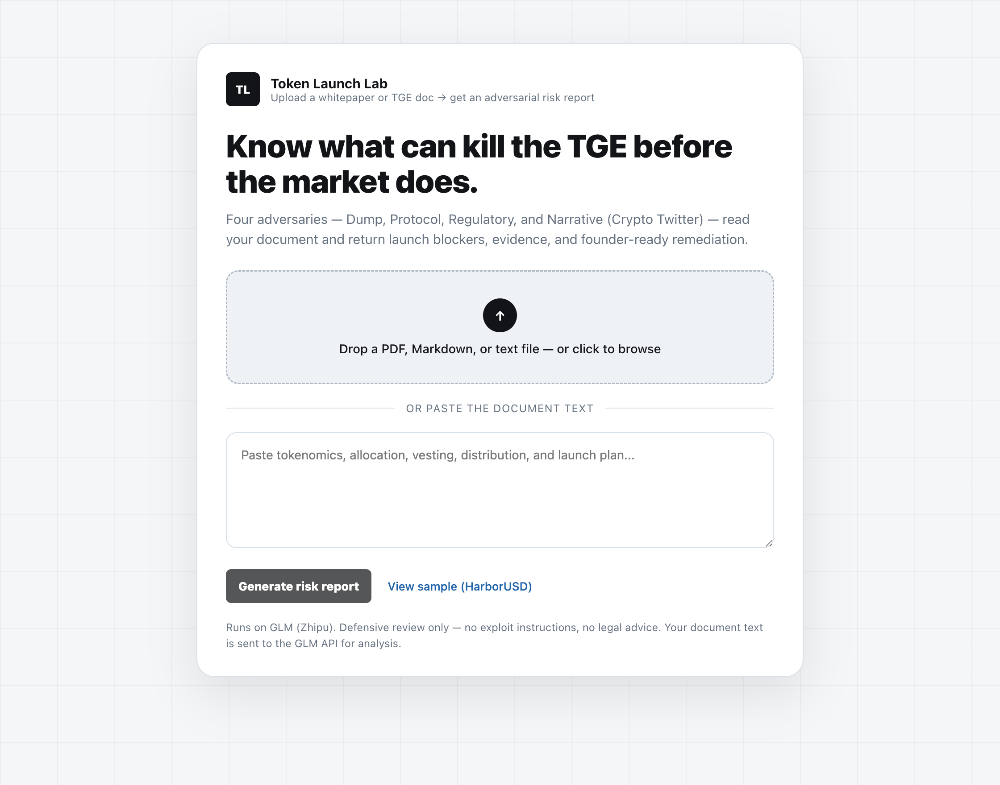

<div align="center">

# 🧪 Token Launch Lab

### *An AI red team that tries to kill your token launch — before the market does.*

Token launches are irreversible. One bad vesting schedule, one missing audit,
one weak narrative, or one regulatory blind spot can torch a launch **in public**.
Upload your whitepaper or TGE doc and four adversarial AI reviewers read it, then
hand you back a **GO / NO-GO decision**, the exact things to fix first, and the
evidence behind every finding.

<br/>

[](#-what-it-does)
[-1f62a8?style=for-the-badge)](https://open.bigmodel.cn)
[](package.json)
[](#-safety-boundaries)

<br/>


</div>

---

## 💡 What it does

Most AI tools help you *build* launch materials. Token Launch Lab does the opposite —
it attacks the launch you already have. Drop in a whitepaper, tokenomics doc, or TGE spec
and it runs a **pre-mortem**: what will kill this launch, ranked, with the fix and the
quote from your own document that proves it.

```
              YOUR WHITEPAPER / TGE DOC  (PDF · Markdown · text · paste)
                              │
        ┌─────────────┬───────┴───────┬──────────────────┐
        ▼             ▼               ▼                  ▼
   📉 DUMP RISK   🛡️ PROTOCOL RISK  ⚖️ REGULATORY RISK   🐦 NARRATIVE (CT)
        └─────────────┴───────┬───────┴──────────────────┘
                              ▼
                        📄 RISK REPORT
             GO / NO-GO score · Fix-first P0 list · evidence · remediation
```

---

## ⚔️ The four adversaries

| Reviewer | Attacks |
|----------|---------|
| 📉 **Dump risk** | Investor/team unlocks, TGE float, liquidity & market-maker allocation, launch-day sell pressure |
| 🛡️ **Protocol risk** | Audit status, emergency pause authority, multisig & treasury control, launch readiness |
| ⚖️ **Regulatory risk** | Sale/distribution mechanics, jurisdiction & eligibility exposure, security-likeness |
| 🐦 **Narrative risk** | How Crypto Twitter ("CT") will react — points-farm optics, unsubstantiated claims, promise-vs-mechanics gaps |

Every finding cites a **near-verbatim quote from your document**. If the document doesn't
say it, the model doesn't claim it.

---

## 🚀 Quickstart

```bash
npm install
```

Add your GLM API key to a local `.env` file (copy from `.env.example`):

```bash
# .env
GLM_API_KEY=your-key-from-open.bigmodel.cn
```

Then start the app and open it in your browser:

```bash
npm run ui
# → http://127.0.0.1:3000
```

Upload a whitepaper / TGE doc (or paste the text) and hit **Generate risk report**.
A full four-adversary report takes ~1–2 minutes. No key yet? Click **View sample
(HarborUSD)** to see a demo report instantly.

> The GLM key lives only in your server environment — end users never see or supply it.
> `.env` and generated `reports/` are gitignored.

---

## 🧭 What's in a report



- **GO / NO-GO decision** with a 0–100 readiness score.
- **Fix first** — the P0 blockers you must clear before announcing, each with a concrete fix.
- **Risk by adversary** — a card per lens (Dump / Protocol / Regulatory / Narrative) with the worst severity and count.
- **Full findings** — every risk with severity, confidence, the evidence quote, why it matters, and remediation.
- **Export PDF** — a clean, printable report you can send to a co-founder or counsel.
- **Share** — a read-only link to the generated report.

---

## 🛡️ Safety boundaries

This is **defensive launch-risk review only**.

- ❌ Does **not** generate exploit instructions or attack payloads.
- ❌ Does **not** give legal advice — regulatory items are risks to review with qualified counsel.
- ❌ Does **not** produce harassment, misinformation, or market-manipulation content.
- ✅ Every finding is grounded in a quote from the document you provided.

---

## 🔧 Config

| Variable | Default | Purpose |
|----------|---------|---------|
| `GLM_API_KEY` | — | **Required.** Your GLM (Zhipu) API key. |
| `GLM_MODEL` | `glm-4.6` | The GLM model used for analysis. |
| `GLM_BASE_URL` | `https://open.bigmodel.cn/api/paas/v4/chat/completions` | GLM chat-completions endpoint. |
| `PORT` | `3000` | Local server port. |

---

## 📂 Repo map

| Path | What's inside |
|------|---------------|
| `src/analyze.js` | Reads the uploaded doc (PDF → text), calls GLM, shapes the risk report |
| `src/demo-server.js` | HTTP server: upload endpoint, report storage, share links, static UI |
| `web/` | The product UI (upload screen + report dashboard) |
| `tge-spec.md` · `outputs/` | The built-in **HarborUSD** sample report |
| `.env.example` | Copy to `.env` and add your key |

---

<div align="center">

### Built for crypto founders who'd rather be killed in private than in public.

*Contributor: Elena Xiao &lt;leini8891@gmail.com&gt;*

</div>
